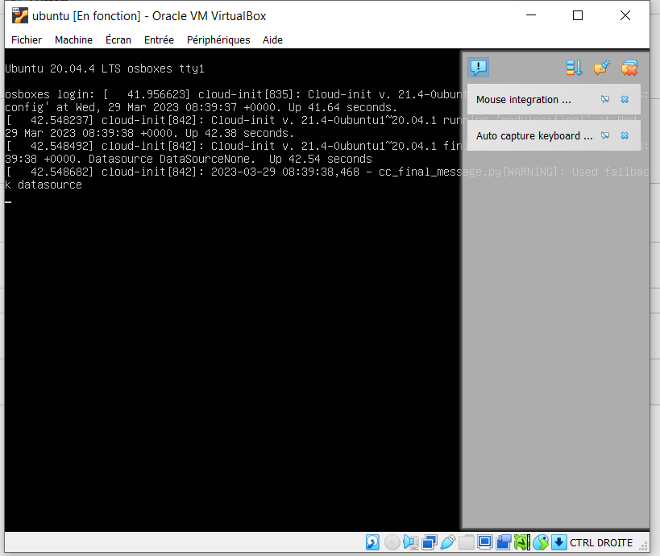
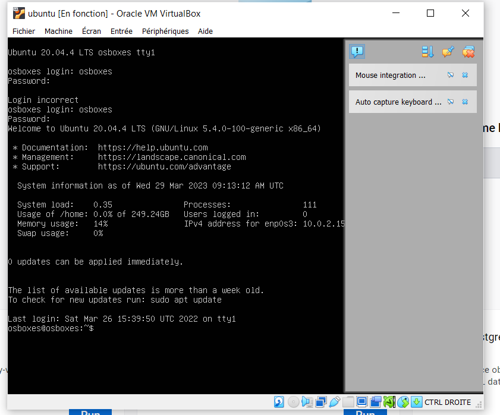

- Installation de vitual box version 7.0 (avec la version 6.2 ça ne marchait pas)
- Création de la machine virtuelle en utilisant le fichier .vdi)
- Apporter le paramétrage nécessaire pour la vm (cpu 2 ...)
- Lancer la vm
- 
-
- S'authentifier (login: osboxes/ mdp: osboxes.org)
- 
-
- Installation de vargrant